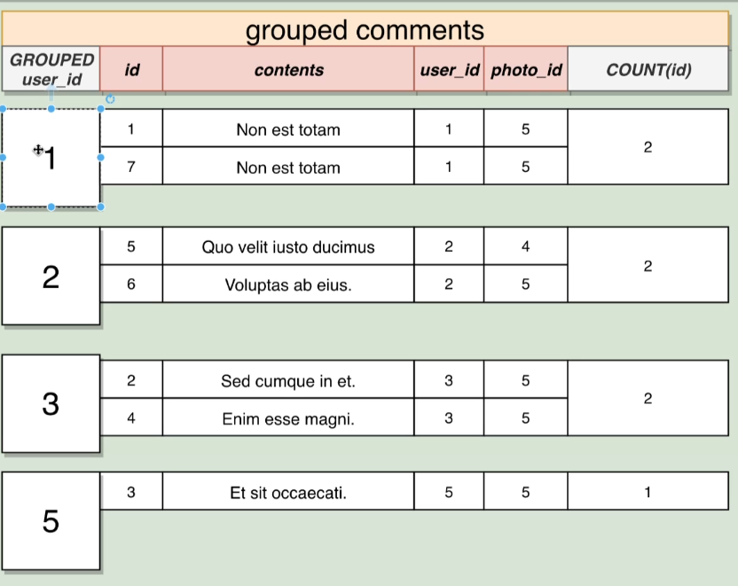

## Groupby


```
SELECT contents
FROM comments
GROUP BY user id;

```


## aggregate

```
SELECT MAX(id)
FROM comments;
```

## group and aggreaget



```
SELECT user_id, COUNT(id) AS noofidbygroupuserid
FROM comments
GROUP BY user id;

SELECT user_id, COUNT(*) AS noofidbygroupuserid
FROM comments
GROUP BY user id;

```

## having

```

SELECT photo_id , COUNT(*)
FROM comments
WHERE photo_id < 3
GROUP BY photo_id
HAVING COUNT(*) > 2

here filtering first by photo id then grouping then filtering the group count

```


